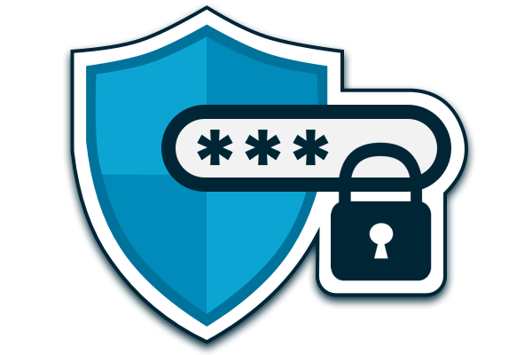

<h1 align="center"><i>EVault</i></h1> 

  

 

## About

Remembering each and every password for hundreds of websites you have applied to is a tedious task indeed. Wouldn't it be relieveing if someone could remember all that for you?

EVault does that for you! Not only can you store passowrds in a secure and stable manner, EVault also helps you in building un-hackable passwords.   

## Features
* Sign-Up/Login for various users
* Store passwords corresponding to different websites
* Check the strength of a password
* Generate password   

<h2 align="center"><i>Developed by</i></h2>

 
 
 

